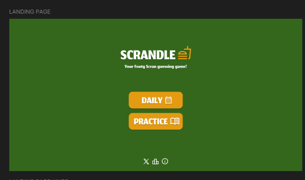
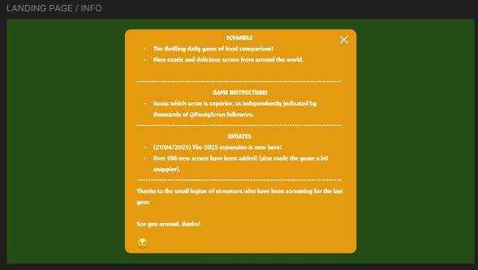
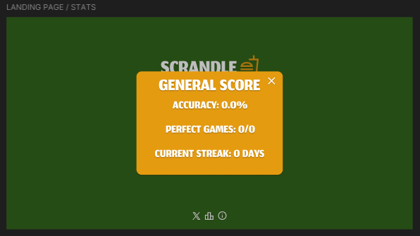
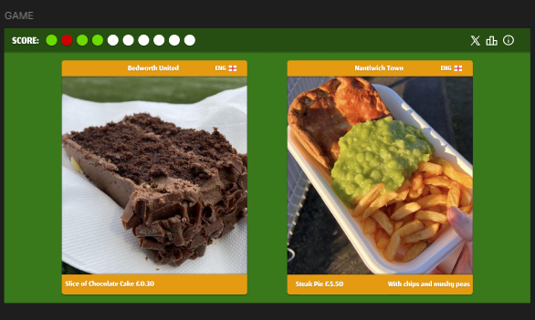
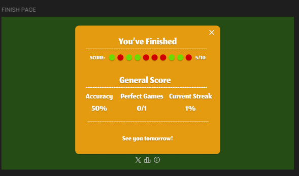
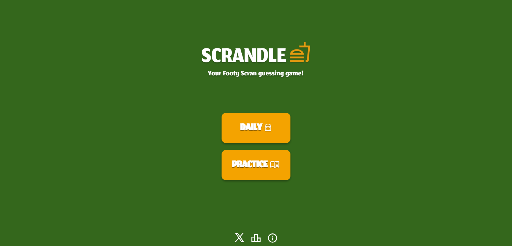
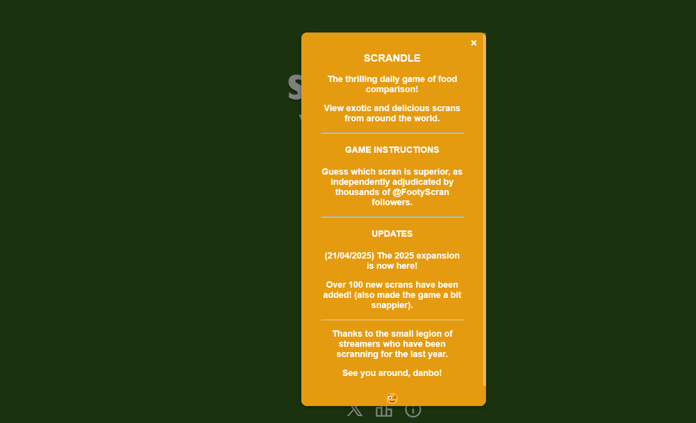
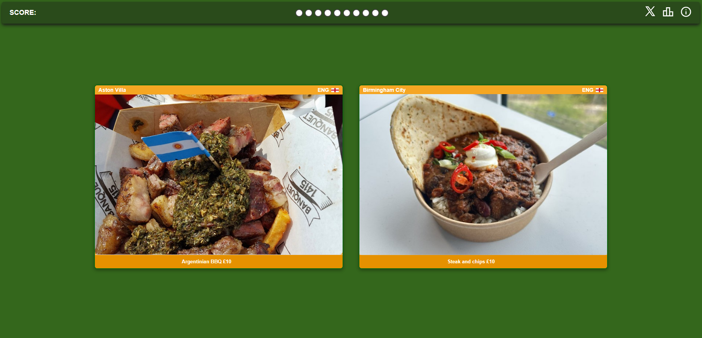
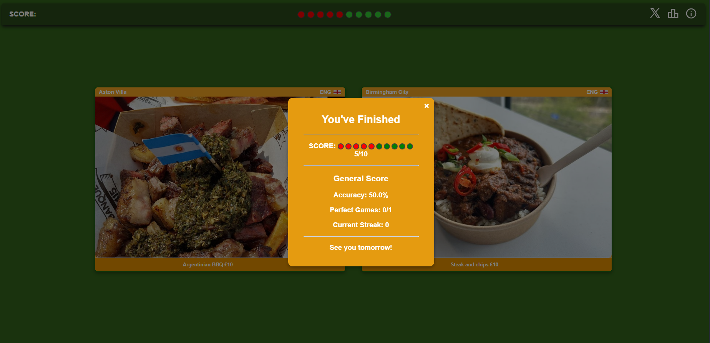

# scrandleRemake

## Descrição do projeto 
Site de entretenimento onde há um jogo de comparação entre dois petiscos de estádios votados nas redes sociais.
A ideia é tentar adivinhar o prato mais votado pelos fãs.

## Tecnologias usadas 
Linguagens HTML, CSS e JavaScript.
Publicação feita no Github Pages. 

## Prints do Figma e do site

### Figma

### Site

## Autores
Celso Filho
Filipe Cavalcanti
Victor Leão